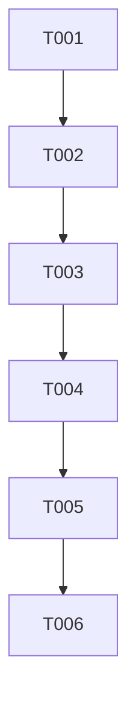

# Action Plan: Transparent CloudEvent Publisher

This document outlines the tasks required to refactor the `NatsPublisher` to make CloudEvents the default, transparent behavior.

## Phase 1: Setup

- [X] T001 Verify the development environment is configured with Java 21 and Maven.

## Phase 2: Foundational Tasks

*(No foundational tasks are required for this feature.)*

## Phase 3: User Story 1 - Transparent CloudEvent Publisher

**Goal**: As a developer, I want to publish a POJO using a simple `NatsPublisher.publish()` method and have it automatically sent as a CloudEvent.

**Independent Test**: A new integration test will be created that injects a `NatsPublisher<MyPojo>`, publishes an object, and uses a NATS client to subscribe and verify that the received message contains all required `ce-` headers and the correct JSON payload.

### Implementation Tasks

- [X] T002 [US1] Modify the `generateSource()` method in `runtime/src/main/java/org/mjelle/quarkus/easynats/CloudEventsHeaders.java` to read the `quarkus.application.name` property using `ConfigProvider`.
- [X] T003 [US1] Refactor `runtime/src/main/java/org/mjelle/quarkus/easynats/NatsPublisher.java` to remove the `publishCloudEvent` methods.
- [X] T004 [US1] Modify the `publish(T payload)` and `publish(String subject, T payload)` methods in `runtime/src/main/java/org/mjelle/quarkus/easynats/NatsPublisher.java` to integrate CloudEvent header generation as the default behavior.
- [X] T005 [US1] Rewrite the tests in `runtime/src/test/java/org/mjelle/quarkus/easynats/NatsPublisherTest.java` to validate the new transparent CloudEvent publishing, including header verification and serialization exception handling.

## Phase 4: Polish & Cross-Cutting Concerns

- [X] T006 Update Javadocs in `runtime/src/main/java/org/mjelle/quarkus/easynats/NatsPublisher.java` to reflect the removal of `publishCloudEvent` and the new default behavior of the `publish` methods.

## Dependencies

The tasks should be completed in the following order:

## Parallel Execution

No tasks in this plan can be executed in parallel due to the direct dependencies between them.

## Implementation Strategy

The implementation will follow the task order directly. The core of the work is a refactoring of the `NatsPublisher` and its corresponding tests. Since this is a breaking change to the API, the focus will be on ensuring the new, simplified API is robust and well-tested.
